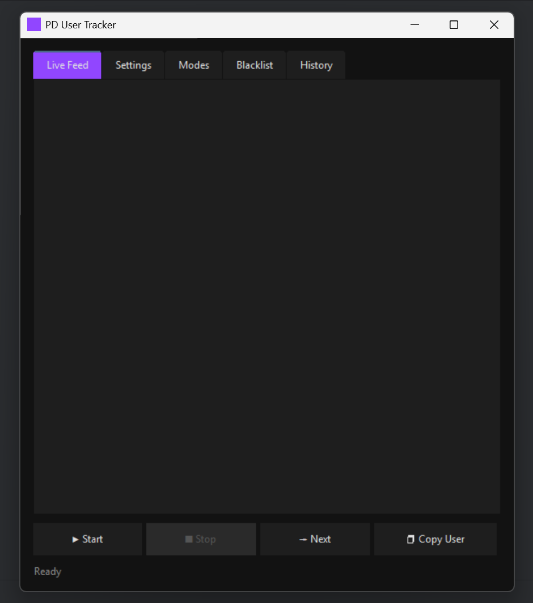
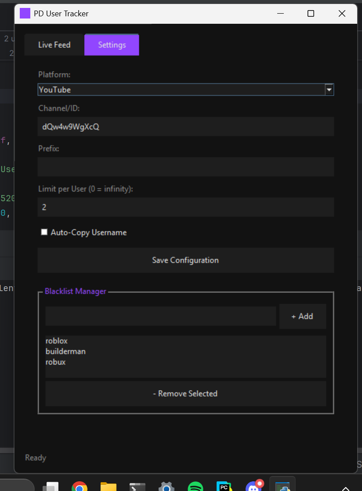

# PD-User-Tracker
_Stream PLS DONATE and donate your chat with ease!_

## Dependencies

```
dependencies = [
    "pytchat (>=0.5.5,<0.6.0)",
    "tkinterweb (>=4.11.0,<5.0.0)",
]
```

## How it looks:

| Preview 1 | Preview 2 |
|----------|----------|
|  |  |
